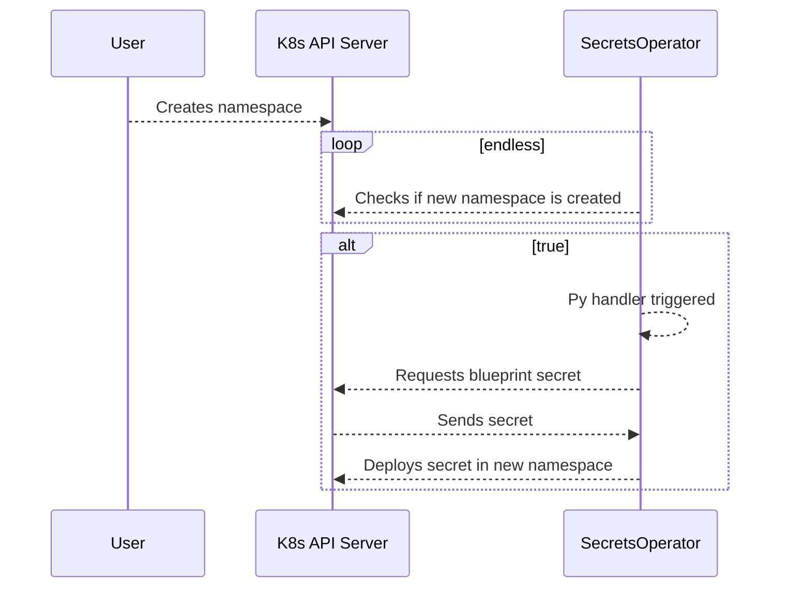

# Secrets Operator

This Kubernetes Operator deploys secrets when a namespace is created. It is used for httpauth secrets at the moment.

This bot scraps a given secret and deploys it to the new namespace

## Sequence Diagram



## Sourcecode

Written in Python3 with `kubernetes` and `kopf` pip module. Stored in the `src`
directory. It is just one file which grabs the proconfigured secrets and applies
it to a new namespace.

## Deployment

This repository contains a Helm Chart where you are able to install the application
directly in Kubernetes. It is stored in `helm/secrets-operator`.

Values for the deployment can be altered in the `values.yaml` file

### Manually

Chart is stored in a Chartmuseum Repository Server:

```bash
helm repo add \
    --username ${hiddenusername} \
    --password ${hiddenpassphrase} \
    stable-infra-charts \
    https://stable-charts.infra.bcc.gmbh
helm repo update stable-infra-charts/
```

Installation / Upgrade:

```bash
helm upgrade ${releasename} \
    --install \
    --values values.yaml \
    --version ${someversion} \
    stable-infra-charts/secrets-operator
```
### Automated

This is done via the CI CD tool by Gitlab.

Executed jobs:

* Every push
    * Code Quality
    * Linting
    * Check if Repository Server is reachable
* Tags:
    * Build new Version of Helm package
    * Build new Docker Image
    * Update Versioncontrol
    * Upgrade Deployments
* Changed `values-*.yaml`
    * Update Deployments

## Author

* Christopher Becker (christopher.becker@genesis-mining.com)
